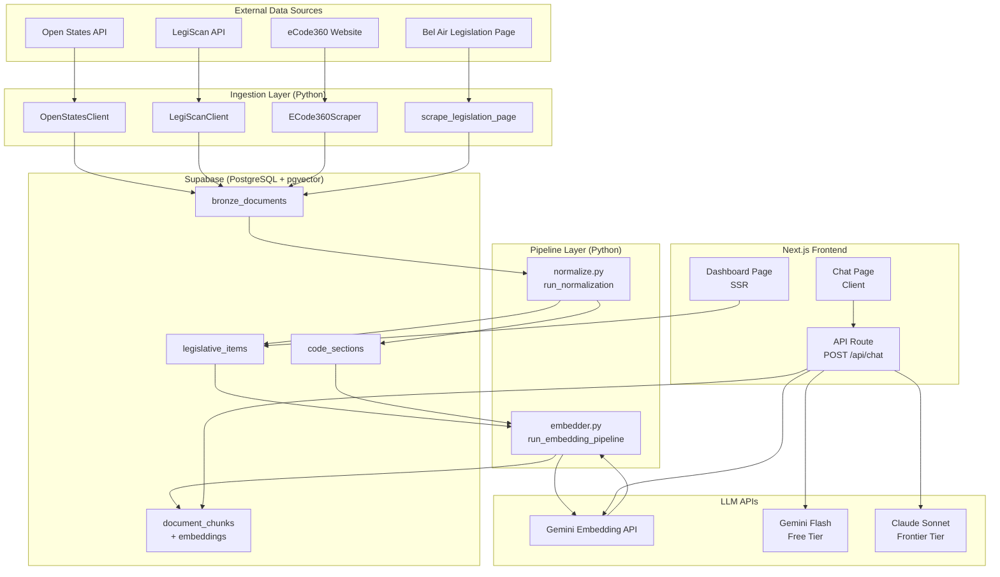
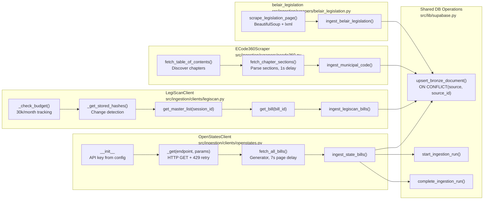
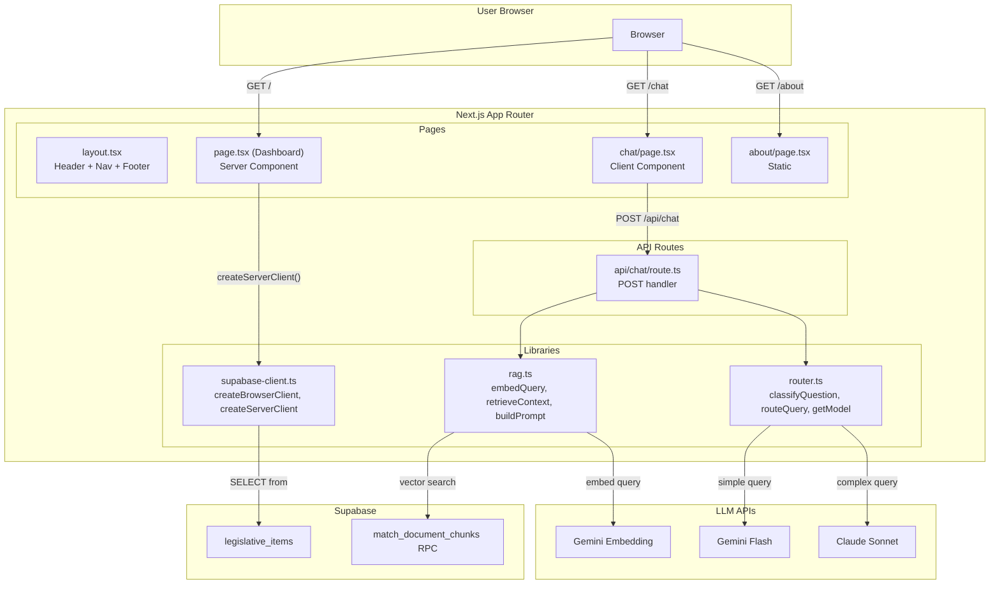
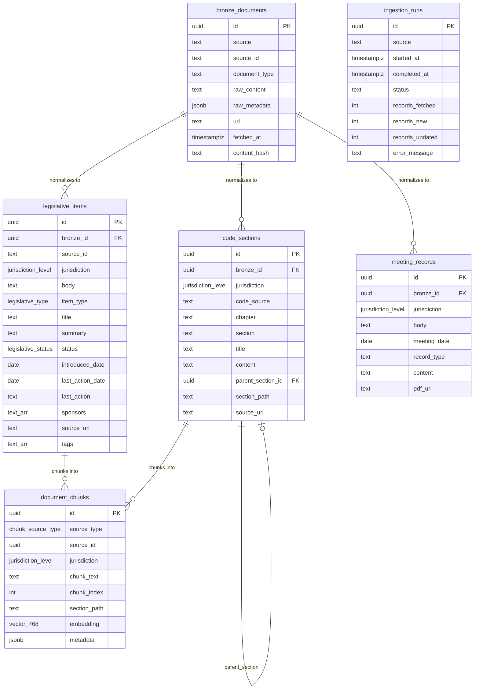
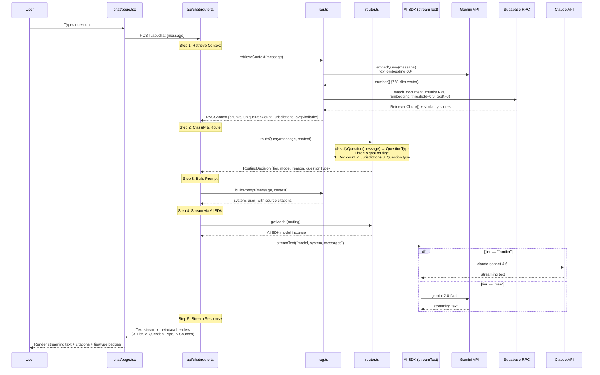
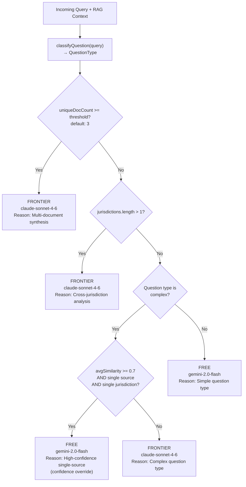

# CivicLens — Application Logic Flow

> **Living document.** Update this whenever control flow, function signatures, or data paths change.
> Last updated: 2026-03-19

---

## Table of Contents

1. [System Overview](#1-system-overview)
2. [Ingestion Layer — Sources to Bronze](#2-ingestion-layer--sources-to-bronze)
3. [Pipeline Layer — Bronze to Silver to Gold](#3-pipeline-layer--bronze-to-silver-to-gold)
4. [Frontend & API — User-Facing Stack](#4-frontend--api--user-facing-stack)
5. [Database Schema — Table Relationships](#5-database-schema--table-relationships)
6. [Chat RAG Pipeline — Detailed Flow](#6-chat-rag-pipeline--detailed-flow)
7. [Model Routing Decision Tree](#7-model-routing-decision-tree)

---

## 1. System Overview



### File Map

| Layer | Key Files |
|-------|-----------|
| Ingestion | `src/ingestion/clients/openstates.py`, `src/ingestion/clients/legiscan.py`, `src/ingestion/scrapers/ecode360.py`, `src/ingestion/scrapers/belair_legislation.py` |
| Pipeline | `src/pipeline/normalize.py`, `src/pipeline/embedder.py` |
| Shared Lib | `src/lib/models.py`, `src/lib/config.py`, `src/lib/supabase.py` |
| Frontend | `src/app/page.tsx`, `src/app/chat/page.tsx`, `src/app/api/chat/route.ts` |
| Frontend Lib | `src/lib/rag.ts`, `src/lib/router.ts`, `src/lib/supabase-client.ts` |
| Database | `supabase/migrations/001_initial_schema.sql` through `004_legislative_items_unique.sql` |

---

## 2. Ingestion Layer — Sources to Bronze



### 2.1 OpenStates Client — Rate-Limit Handling

**File:** `src/ingestion/clients/openstates.py`

The client wraps all API calls through `_get()` which handles 429 (rate limit) responses with exponential backoff:

```python
# src/ingestion/clients/openstates.py — _get() method
def _get(self, endpoint: str, params: dict | None = None) -> dict:
    url = f"{self.BASE_URL}/{endpoint}"
    headers = {"X-API-KEY": self.api_key}
    for attempt in range(1, self.MAX_RETRIES + 1):
        resp = requests.get(url, headers=headers, params=params)
        if resp.status_code == 429:
            wait = 7 * attempt
            logger.warning("Rate-limited (429). Waiting %ds (attempt %d)", wait, attempt)
            time.sleep(wait)
            continue
        resp.raise_for_status()
        return resp.json()
```

The paginated generator `fetch_all_bills()` yields individual bills with a 7-second inter-page delay:

```python
# src/ingestion/clients/openstates.py — fetch_all_bills()
def fetch_all_bills(self, session=None, updated_since=None):
    page = 1
    while True:
        data = self.fetch_bills(session, updated_since, page=page, per_page=20)
        results = data.get("results", [])
        if not results:
            break
        for bill in results:
            yield bill
        page += 1
        time.sleep(7)  # Stay under 10 req/min
```

### 2.2 LegiScan Client — Budget & Hash Tracking

**File:** `src/ingestion/clients/legiscan.py`

Budget enforcement prevents exceeding the 30k/month API limit:

```python
# src/ingestion/clients/legiscan.py — _check_budget()
def _check_budget(self) -> None:
    if self.queries_used >= self.MONTHLY_LIMIT:
        raise LegiScanError("Monthly query budget exhausted")
    if self.queries_used >= self.MONTHLY_LIMIT * 0.8:
        warnings.warn("LegiScan budget at 80%", LegiScanBudgetWarning)
```

Hash-based change detection skips unchanged bills:

```python
# src/ingestion/clients/legiscan.py — ingest_legiscan_bills()
stored_hashes = self._get_stored_hashes("change")
master = self.get_master_list_raw(session_id)
for bill_id, info in master.items():
    if stored_hashes.get(bill_id) == info["change_hash"]:
        continue  # Skip unchanged
    bill = self.get_bill(int(bill_id))
    upsert_bronze_document(db, source="legiscan", ...)
```

### 2.3 eCode360 Scraper — Hierarchical Code Parsing

**File:** `src/ingestion/scrapers/ecode360.py`

Two-pass strategy: discover chapters from TOC, then parse each chapter's sections:

```python
# src/ingestion/scrapers/ecode360.py — ingest_municipal_code()
scraper = ECode360Scraper(municipality_code)
chapters = scraper.fetch_table_of_contents()
for chapter in chapters:
    for section in scraper.fetch_chapter_sections(chapter):
        upsert_bronze_document(
            db, source=source_name, source_id=section.code_id,
            document_type="code_section", raw_content=section.content,
            raw_metadata={"chapter": chapter.title, "section_title": section.title,
                          "level": section.level, "municipality_code": municipality_code},
            url=section.url,
        )
```

### 2.4 Bel Air Legislation Scraper

**File:** `src/ingestion/scrapers/belair_legislation.py`

Parses a simple HTML table, classifying entries as ordinances or resolutions:

```python
# src/ingestion/scrapers/belair_legislation.py — scrape_legislation_page()
@dataclass
class LegislationEntry:
    number: str       # "Ordinance 743" or "Resolution 2024-01"
    title: str
    status: str       # "Pending", "Approved", "Tabled", "Expired", "Rejected"
    item_type: str    # "ordinance" or "resolution"
```

### 2.5 Shared Bronze Upsert

**File:** `src/lib/supabase.py`

All ingestion modules converge on this single write path:

```python
# src/lib/supabase.py — upsert_bronze_document()
def upsert_bronze_document(client, *, source, source_id, document_type,
                           raw_content, raw_metadata=None, url=None):
    row = {
        "source": source, "source_id": source_id,
        "document_type": document_type, "raw_content": raw_content,
        "raw_metadata": raw_metadata or {},
        "url": url, "fetched_at": datetime.now(timezone.utc).isoformat(),
        "content_hash": content_hash(raw_content),  # SHA-256
    }
    return client.table("bronze_documents") \
        .upsert(row, on_conflict="source,source_id").execute()
```

---

## 3. Pipeline Layer — Bronze to Silver to Gold

```mermaid
flowchart TB
    subgraph Bronze["Bronze Layer"]
        BD[bronze_documents table]
    end

    subgraph Normalize["normalize.py — run_normalization()<br/>src/pipeline/normalize.py"]
        ROUTE{"Route by<br/>source name"}
        N_OS["normalize_openstates_bill()"]
        N_BA["normalize_belair_legislation()"]
        N_EC["normalize_ecode360_section()"]
    end

    subgraph Silver["Silver Layer"]
        LI[legislative_items]
        CS[code_sections]
    end

    subgraph Embed["embedder.py — run_embedding_pipeline()<br/>src/pipeline/embedder.py"]
        CHUNK_CS["chunk_code_section()<br/>4KB max, 200-char overlap"]
        CHUNK_LI["chunk_legislative_item()<br/>title + summary, single chunk"]
        GEN_EMB["generate_embeddings()<br/>Gemini or MiniLM"]
    end

    subgraph Gold["Gold Layer"]
        DC[document_chunks<br/>+ vector(768)]
    end

    BD --> ROUTE
    ROUTE -->|"openstates"| N_OS
    ROUTE -->|"belair_legislation"| N_BA
    ROUTE -->|"ecode360_*"| N_EC
    N_OS --> LI
    N_BA --> LI
    N_EC --> CS

    LI --> CHUNK_LI
    CS --> CHUNK_CS
    CHUNK_LI --> GEN_EMB
    CHUNK_CS --> GEN_EMB
    GEN_EMB --> DC
```

### 3.1 Normalization — Source-Specific Transforms

**File:** `src/pipeline/normalize.py`

Router dispatches by source name:

```python
# src/pipeline/normalize.py — run_normalization()
NORMALIZERS = {
    "openstates": normalize_openstates_bill,
    "belair_legislation": normalize_belair_legislation,
}

for row in result.data:
    row_source = row["source"]
    if row_source in ("ecode360_belair", "ecode360_harford"):
        section = normalize_ecode360_section(row["id"], row["raw_content"], row["raw_metadata"])
        _upsert_code_section(db, section)
    elif row_source in NORMALIZERS:
        item = NORMALIZERS[row_source](bronze_id=row["id"], raw=row["raw_content"])
        _upsert_legislative_item(db, item)
```

OpenStates status mapping (action classification → unified enum):

```python
# src/pipeline/normalize.py
OPENSTATES_STATUS_MAP = {
    "introduced":              LegislativeStatus.INTRODUCED,
    "referred-to-committee":   LegislativeStatus.IN_COMMITTEE,
    "passed-lower-chamber":    LegislativeStatus.PASSED_ONE_CHAMBER,
    "passed-upper-chamber":    LegislativeStatus.PASSED_ONE_CHAMBER,
    "signed":                  LegislativeStatus.ENACTED,
    "became-law":              LegislativeStatus.ENACTED,
    "vetoed":                  LegislativeStatus.VETOED,
    "failed":                  LegislativeStatus.REJECTED,
}
```

### 3.2 Chunking — Section-Aware Splitting

**File:** `src/pipeline/embedder.py`

Code sections use paragraph-boundary splitting with overlap:

```python
# src/pipeline/embedder.py — chunk_code_section()
MAX_CHUNK_CHARS = 4000
SUB_CHUNK_OVERLAP = 200

def chunk_code_section(section_id, content, section_path, jurisdiction):
    if len(content) <= MAX_CHUNK_CHARS:
        return [DocumentChunk(..., chunk_text=content, metadata={"full_section": True})]

    paragraphs = content.split("\n\n")
    chunks, current_chunk = [], ""
    for para in paragraphs:
        if len(current_chunk) + len(para) > MAX_CHUNK_CHARS and current_chunk:
            chunks.append(DocumentChunk(..., chunk_text=current_chunk))
            current_chunk = current_chunk[-SUB_CHUNK_OVERLAP:] + "\n\n" + para
        else:
            current_chunk += ("\n\n" if current_chunk else "") + para
    # ... flush remaining
```

Legislative items use a single chunk (title + summary):

```python
# src/pipeline/embedder.py — chunk_legislative_item()
def chunk_legislative_item(item_id, title, summary, jurisdiction, body):
    text = f"{title}\n\n{summary}" if summary else title
    return [DocumentChunk(
        source_type=ChunkSourceType.LEGISLATIVE_ITEM,
        source_id=str(item_id), chunk_text=text,
        section_path=f"{body} > {title}",
        metadata={"has_summary": bool(summary)},
    )]
```

### 3.3 Embedding Generation

**File:** `src/pipeline/embedder.py`

Config-driven model selection:

```python
# src/pipeline/embedder.py — generate_embeddings()
def generate_embeddings(texts):
    config = get_config()
    if config.embedding_model == "gemini":
        return _embed_gemini(texts, config.google_ai_api_key)
    return _embed_minilm(texts)

def _embed_gemini(texts, api_key):
    client = genai.Client(api_key=api_key)
    embeddings = []
    for text in texts:
        result = client.models.embed_content(model="text-embedding-004", contents=text)
        embeddings.append(result.embeddings[0].values)
    return embeddings
```

---

## 4. Frontend & API — User-Facing Stack



### 4.1 Dashboard — Server-Side Rendering

**File:** `src/app/page.tsx`

The dashboard fetches legislative items at request time (SSR):

```typescript
// src/app/page.tsx — fetchLegislativeItems()
// @spec DASH-VIEW-001, DASH-VIEW-002
async function fetchLegislativeItems(jurisdiction?: string) {
  const supabase = createServerClient();
  let query = supabase
    .from("legislative_items")
    .select("*")
    .order("last_action_date", { ascending: false })
    .limit(50);

  if (jurisdiction && jurisdiction !== "ALL") {
    query = query.eq("jurisdiction", jurisdiction);
  }
  const { data, error } = await query;
  return error ? [] : (data as LegislativeItem[]);
}
```

Status badges map legislative statuses to colors:

```typescript
// src/app/page.tsx — statusColor()
function statusColor(status: string): string {
  const colors: Record<string, string> = {
    INTRODUCED: "bg-blue-100 text-blue-800",
    IN_COMMITTEE: "bg-yellow-100 text-yellow-800",
    PASSED_ONE_CHAMBER: "bg-green-100 text-green-800",
    ENACTED: "bg-green-200 text-green-900",
    VETOED: "bg-red-100 text-red-800",
    // ...
  };
  return colors[status] || "bg-gray-100 text-gray-800";
}
```

### 4.2 Chat — Client-Side Streaming Interaction

**File:** `src/app/chat/page.tsx`

Client component manages conversation state and streams responses from the API.
Metadata (sources, tier, question type) is parsed from custom response headers.
Text is streamed incrementally and rendered with a typing cursor.

```typescript
// src/app/chat/page.tsx — handleSubmit() (streaming)
// @spec CHAT-UI-001, CHAT-UI-002
const handleSubmit = useCallback(async (query?: string) => {
  const text = query || input.trim();
  setMessages((prev) => [...prev, { role: "user", content: text }]);
  setLoading(true);
  setStreamingContent("");

  const response = await fetch("/api/chat", {
    method: "POST",
    headers: { "Content-Type": "application/json" },
    body: JSON.stringify({ message: text }),
  });

  // Metadata from custom headers
  const tier = response.headers.get("X-Tier");
  const questionType = response.headers.get("X-Question-Type");
  const sources = JSON.parse(response.headers.get("X-Sources") || "[]");

  // Stream plain text response
  const reader = response.body?.getReader();
  const decoder = new TextDecoder();
  let fullText = "";
  while (true) {
    const { done, value } = await reader.read();
    if (done) break;
    fullText += decoder.decode(value, { stream: true });
    setStreamingContent(fullText);
  }

  setMessages((prev) => [...prev, {
    role: "assistant", content: fullText,
    sources, tier, questionType,
  }]);
}, [input, loading]);
```

---

## 5. Database Schema — Table Relationships



### Schema Files

| Migration | Purpose | Key Objects |
|-----------|---------|-------------|
| `supabase/migrations/001_initial_schema.sql` | Core tables, enums, pgvector extension, HNSW index | All tables above, `update_updated_at()` trigger |
| `supabase/migrations/002_vector_search_rpc.sql` | RAG retrieval function | `match_document_chunks()` RPC |
| `supabase/migrations/003_legiscan_compliance.sql` | LegiScan hash tracking | `legiscan_change_hash` column, `legiscan_dataset_hashes` table |
| `supabase/migrations/004_legislative_items_unique.sql` | Upsert support | `uq_legitem_source`, `uq_codesec_source` constraints |

### Key Unique Constraints

```sql
-- supabase/migrations/001_initial_schema.sql
UNIQUE(source, source_id)  -- bronze_documents

-- supabase/migrations/004_legislative_items_unique.sql
UNIQUE(source_id, jurisdiction, body)    -- legislative_items
UNIQUE(code_source, chapter, section)    -- code_sections
```

---

## 6. Chat RAG Pipeline — Detailed Flow



### 6.1 Query Embedding

**File:** `src/lib/rag.ts`

```typescript
// src/lib/rag.ts — embedQuery()
// @spec CHAT-RAG-001
export async function embedQuery(query: string): Promise<number[]> {
  const res = await fetch(
    `https://generativelanguage.googleapis.com/v1/models/text-embedding-004:embedContent?key=${process.env.GOOGLE_AI_API_KEY}`,
    {
      method: "POST",
      headers: { "Content-Type": "application/json" },
      body: JSON.stringify({
        content: { parts: [{ text: query }] },
        taskType: "RETRIEVAL_QUERY",
      }),
    }
  );
  const data = await res.json();
  return data.embedding.values;
}
```

### 6.2 Vector Search via Supabase RPC

**File:** `src/lib/rag.ts` (caller) + `supabase/migrations/002_vector_search_rpc.sql` (implementation)

```typescript
// src/lib/rag.ts — retrieveContext()
// @spec CHAT-RAG-002
const { data } = await supabase.rpc("match_document_chunks", {
  query_embedding: queryEmbedding,
  match_threshold: 0.3,
  match_count: topK,
  filter_jurisdiction: options.jurisdiction || null,
});
```

```sql
-- supabase/migrations/002_vector_search_rpc.sql
CREATE FUNCTION match_document_chunks(
  query_embedding vector(768),
  match_threshold float DEFAULT 0.3,
  match_count int DEFAULT 8,
  filter_jurisdiction text DEFAULT NULL
) RETURNS TABLE (
  id uuid, chunk_text text, section_path text,
  jurisdiction jurisdiction_level, source_type chunk_source_type,
  source_id uuid, metadata jsonb, similarity float
) AS $$
  SELECT dc.id, dc.chunk_text, dc.section_path, dc.jurisdiction,
         dc.source_type, dc.source_id, dc.metadata,
         1 - (dc.embedding <=> query_embedding) AS similarity
  FROM document_chunks dc
  WHERE 1 - (dc.embedding <=> query_embedding) > match_threshold
    AND (filter_jurisdiction IS NULL OR dc.jurisdiction::text = filter_jurisdiction)
  ORDER BY dc.embedding <=> query_embedding
  LIMIT match_count;
$$ LANGUAGE sql STABLE;
```

### 6.3 Prompt Construction

**File:** `src/lib/rag.ts`

```typescript
// src/lib/rag.ts — buildPrompt()
// @spec CHAT-RAG-003
export function buildPrompt(userQuery: string, context: RAGContext) {
  const contextBlocks = context.chunks
    .map((c, i) => `[Source ${i + 1}: ${c.section_path} (${c.jurisdiction})]\n${c.chunk_text}`)
    .join("\n\n---\n\n");

  const system = `You are CivicLens, a civic transparency assistant for Bel Air, Maryland (21015).
...
RELEVANT CONTEXT:
${contextBlocks}`;

  return { system, user: userQuery };
}
```

---

## 7. Model Routing Decision Tree

### Question Type Classification

**File:** `src/lib/router.ts` — `classifyQuestion()`

Queries are first classified into one of 8 question types using pattern matching:

| Type | Tier | Example |
|------|------|---------|
| `factual_lookup` | Free | "What is the fence height limit?" |
| `definition` | Free | "What does 'setback' mean?" |
| `status_check` | Free | "What is the status of HB 1234?" |
| `procedural` | Free | "How do I apply for a building permit?" |
| `comparison` | Frontier | "How do state and county noise rules differ?" |
| `analysis` | Frontier | "How would HB 1234 affect Bel Air zoning?" |
| `multi_jurisdiction` | Frontier | "What do all three levels of government say?" |
| `synthesis` | Frontier | "Give me a comprehensive overview of regulations" |

### Three-Signal Routing



The confidence override is the key cost optimization: when RAG returns highly relevant results from a single source, even complex-sounding queries can be answered by the free model since the context is strong enough — the model just needs to summarize, not reason across documents.

```typescript
// src/lib/router.ts — routeQuery() with three-signal routing
// @spec CHAT-ROUTE-001
export function routeQuery(query: string, context: RAGContext): RoutingDecision {
  const docThreshold = parseInt(process.env.MODEL_ROUTING_DOC_THRESHOLD ?? "3");
  const questionType = classifyQuestion(query);
  const isComplexType = !SIMPLE_TYPES.includes(questionType);

  // Signal 1: doc count
  if (context.uniqueDocCount >= docThreshold) {
    return { tier: "frontier", model: "claude-sonnet-4-6", reason: "...", questionType };
  }
  // Signal 2: multi-jurisdiction
  if (context.jurisdictions.length > 1) {
    return { tier: "frontier", model: "claude-sonnet-4-6", reason: "...", questionType };
  }
  // Signal 3: question type + confidence override
  if (isComplexType) {
    if (context.avgSimilarity >= 0.7 && context.uniqueDocCount <= 1 && context.jurisdictions.length <= 1) {
      return { tier: "free", model: "gemini-2.0-flash", reason: "...", questionType };
    }
    return { tier: "frontier", model: "claude-sonnet-4-6", reason: "...", questionType };
  }
  return { tier: "free", model: "gemini-2.0-flash", reason: "...", questionType };
}
```

### AI SDK Model Resolution

**File:** `src/lib/router.ts` — `getModel()`

Model calls now use the Vercel AI SDK instead of raw HTTP fetch calls:

```typescript
// src/lib/router.ts — getModel()
// @spec CHAT-MODEL-001, CHAT-MODEL-002
import { google } from "@ai-sdk/google";
import { anthropic } from "@ai-sdk/anthropic";

export function getModel(routing: RoutingDecision) {
  if (routing.tier === "frontier") {
    return anthropic("claude-sonnet-4-6");
  }
  return google("gemini-2.0-flash");
}
```

The route handler streams the response using `streamText()`:

```typescript
// src/app/api/chat/route.ts — streaming with AI SDK
import { streamText } from "ai";
import { getModel } from "@/lib/router";

const result = streamText({
  model: getModel(routing),
  system,
  messages: [{ role: "user", content: user }],
  maxOutputTokens: 2048,
});

return result.toTextStreamResponse({
  headers: {
    "X-Model": routing.model,
    "X-Tier": routing.tier,
    "X-Question-Type": routing.questionType,
    "X-Sources": JSON.stringify(sources),
  },
});
```

---

## Maintenance Guide

**When to update this document:**

| Change Type | What to Update |
|------------|----------------|
| New ingestion source | Section 2 + new node in Section 1 diagram |
| New normalizer | Section 3.1 + Section 1 diagram |
| Schema migration | Section 5 ER diagram + migration table |
| New API route | Section 4 + Section 6 if RAG-related |
| Routing logic change | Section 7 decision tree + code snippets |
| New LLM provider | Section 7 LLM calls + Section 1 LLMs subgraph |
| Chunking strategy change | Section 3.2 code snippets |

**How to verify accuracy:**

```bash
# Check that all referenced functions still exist
grep -r "def ingest_state_bills\|def ingest_legiscan_bills\|def ingest_municipal_code\|def ingest_belair_legislation" src/ingestion/
grep -r "def run_normalization\|def run_embedding_pipeline" src/pipeline/
grep -r "embedQuery\|retrieveContext\|buildPrompt\|routeQuery\|callModel" src/lib/
```
